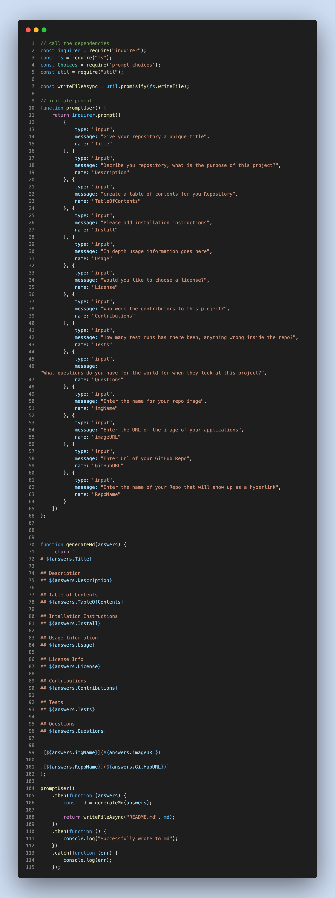

# ReadME.md Generator 

## Description
* As a coder I want to be able to creat my repository automaticalled from the CLI. 

## Table of Contents
* 1 

## Intallation Instructions
* npm install --save 

## Usage Information
* depth and delight 

## License Info
* Creative Commons license 

## Contributions
* Id like to thank the contributors.., 

## Tests
* ... 

## Frequently asked questions
*  

 "
"

